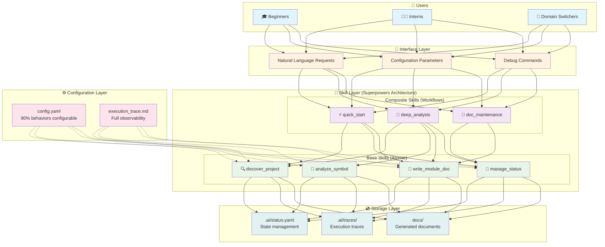
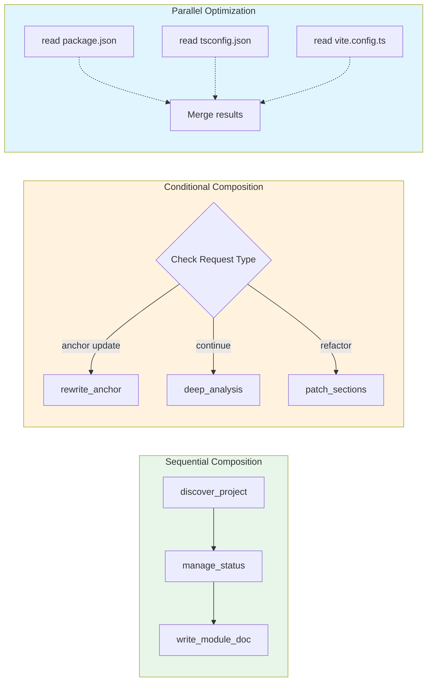
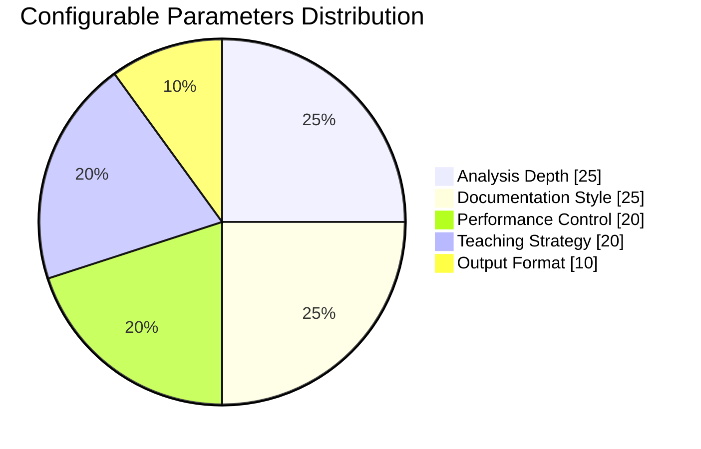
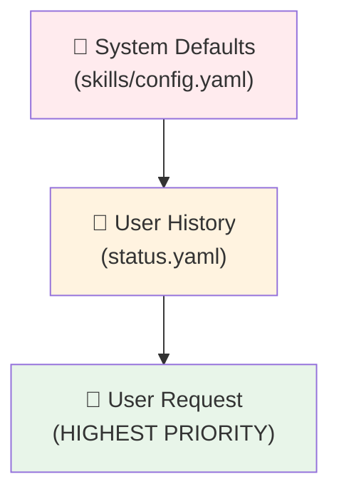
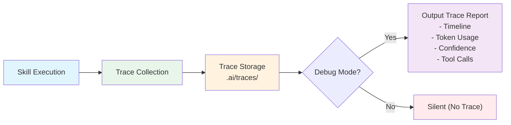
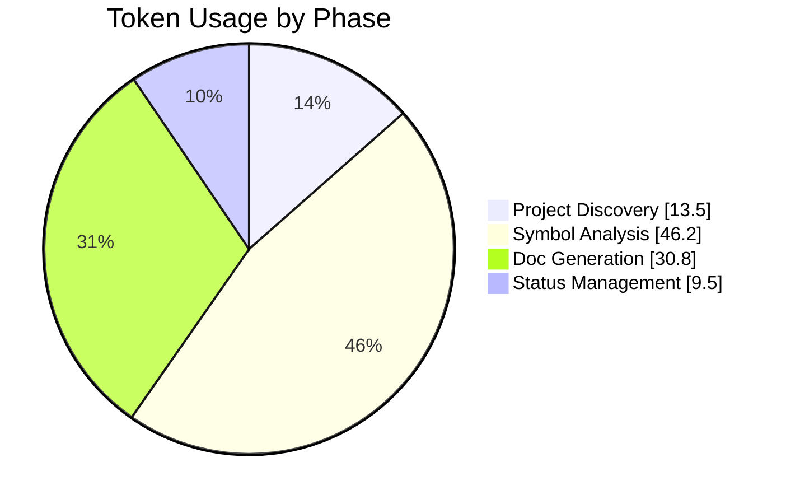
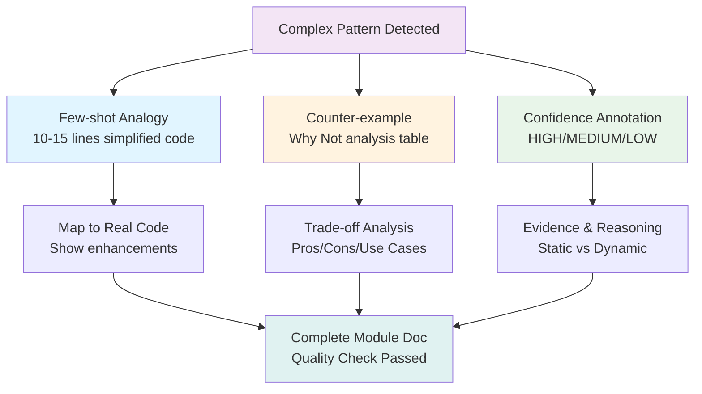
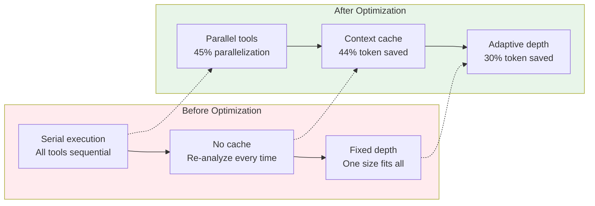
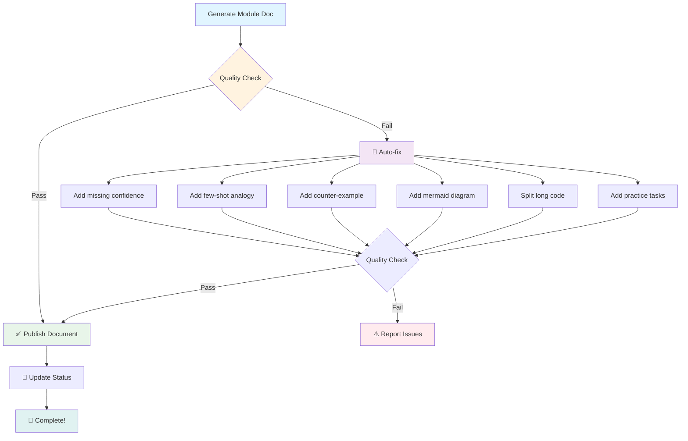

# 🚀 Architecture Overview

> Visual guide to Project Learning Guide skill architecture

---

## 🎨 System Architecture Diagram



---

## 🔄 Data Flow: Quick Start Scenario

```mermaid
sequenceDiagram
  autonumber
  
  participant User as 👤 User
  interface as 💬 Interface
  QS as ⚡ quick_start
  DP as 🔍 discover_project
  MS as 💾 manage_status
  WD as 📝 write_module_doc
  FS as 📁 File System

  User->>interface: "Help me understand this project"
  interface->>QS: Trigger quick_start skill
  
  QS->>DP: Execute project discovery
  DP->>FS: Read package.json, tsconfig, etc.
  FS-->>DP: Config files content
  DP->>FS: Glob for entry points
  FS-->>DP: main.ts, router/index.ts
  DP-->>QS: project_map (87 files, frontend-react)
  
  QS->>MS: Initialize status
  MS->>FS: Create .ai/status.yaml
  MS-->>QS: Status initialized (phase: skeleton)
  
  QS->>WD: Generate tech overview skeleton
  WD->>FS: Create docs/project/tech-overview.md
  WD-->>QS: Skeleton with anchors
  
  QS-->>interface: ✅ Quick start complete!
  interface-->>User: 📚 View generated documents
  
  Note over User,FS: Total time: ~3s, Tokens: ~6,000
```

---

## 🎯 Skill Composition Patterns



---

## 📊 Configuration System



### Configuration Override Priority



---

## 🔍 Execution Trace System



### Trace Metrics Dashboard



---

## 🎓 Teaching Strategy Architecture



---

## 📈 Performance Optimization



---

## 🏆 Quality Assurance Pipeline



---

<div align="center">

**Visual Architecture Guide - Project Learning Guide**

*Built with Mermaid diagrams for maximum clarity*

</div>
