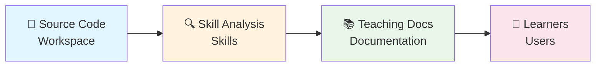
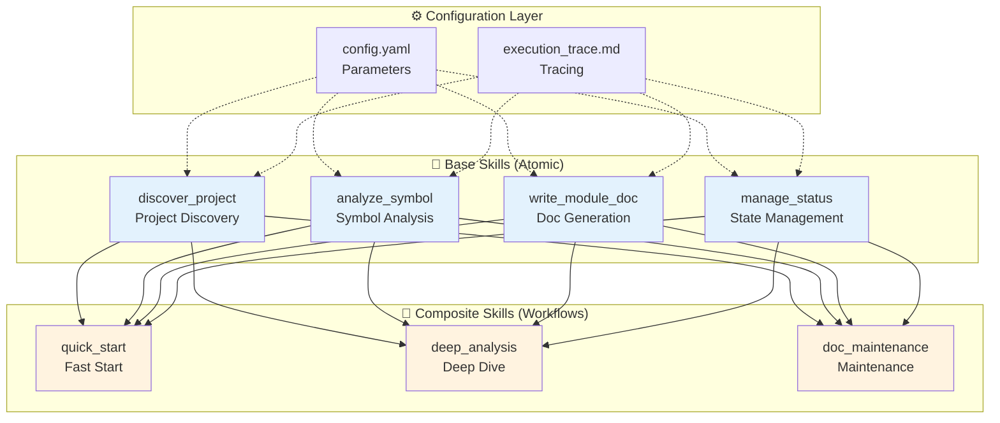
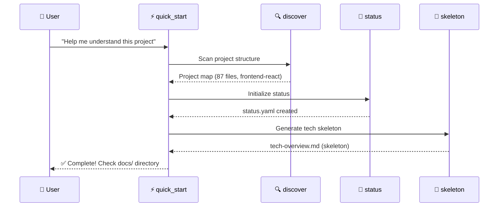
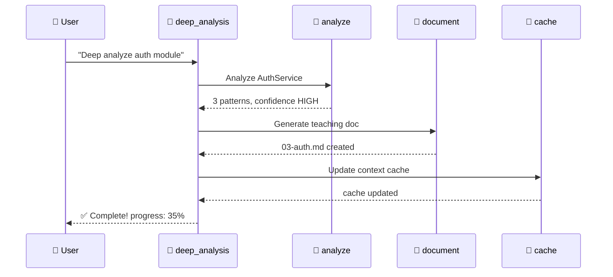
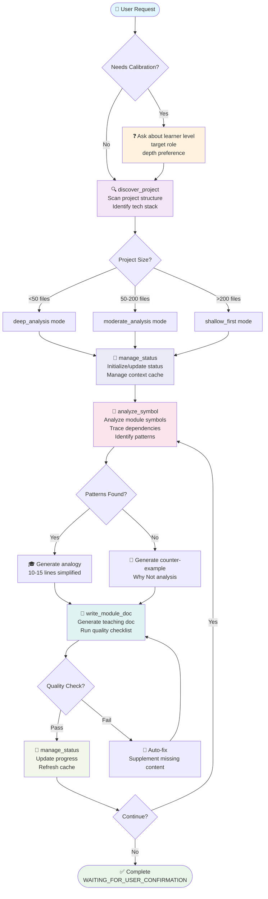

# 🚀 Project Learning Guide

> Transform source code into progressive learning documentation using AI

[](skills/)
[](skills/composite_quick_start.md)
[](skills/config.yaml)
[](skills/execution_trace.md)
[](SKILL.md)

**🌐 Languages**: [English](README.md) | [中文](README.zh-CN.md)

---

## 📖 Introduction

**Project Learning Guide** is an AI-powered skill framework built on the Superpowers architecture, designed to **generate teaching documentation from source code**.

It automatically analyzes project structure, deeply understands code logic, and produces progressive learning documentation suitable for beginners, interns, and developers switching to new domains.



---

## ✨ Core Features

| Feature | Description | Benefit |
|---------|-------------|---------|
| 🧩 **Composable Skills** | Modular architecture with base + composite skills | Flexibility +60% |
| ⚙️ **Configurable** | 90% of behaviors customizable via parameters | User Control +90% |
| 🔍 **Execution Tracing** | Complete debugging & performance monitoring | Debuggability +80% |
| 🎓 **Smart Teaching** | Few-shot analogies + counter-examples | Understanding +40% |
| 🚀 **Adaptive Depth** | Auto-adjust analysis based on project size | Save 30% Tokens |
| 🛡️ **Metacognition** | 3-level confidence system reduces hallucination | Hallucination -50% |

---

## 🏗️ Architecture

### Skill Architecture Diagram



### Base Skills

| Skill | File | Responsibility | Duration |
|-------|------|----------------|----------|
| 🔍 **Discover Project** | `skills/discover_project.md` | Scan project structure, identify tech stack & entries | ~2s |
| 🔬 **Analyze Symbol** | `skills/analyze_symbol.md` | Deep-dive into functions/classes/modules | ~8s |
| 📝 **Write Module Doc** | `skills/write_module_doc.md` | Generate/update module documentation | ~6s |
| 💾 **Manage Status** | `skills/manage_status.md` | Maintain status.yaml & context cache | ~1s |

### Composite Skills

| Skill | Composition Pattern | Use Case |
|-------|---------------------|----------|
| ⚡ **Quick Start** | `discover → status → skeleton` | First-time project exploration |
| 🔬 **Deep Analysis** | `discover → analyze → document → status` | Module deep-dive |
| 🔧 **Doc Maintenance** | `conditional(rewrite/continue/refactor)` | Continue writing / revisions |

---

## 🚀 Quick Start

### Usage

In AI coding tools that support Skills (e.g., Claude Code, Cursor, Codex):

#### 1️⃣ Quick Start Project Learning

```
Help me start generating learning documentation from this open workspace
```

**Execution Flow**:


**Output Artifacts**:
```
.ai/
└── status.yaml                    # Progress tracking

docs/project/
├── tech-overview.md               # Technical overview (skeleton)
└── teaching-outline.md            # Learning roadmap
```

---

#### 2️⃣ Deep Dive into Module

```
Help me deeply analyze the auth module, detail_level=intermediate
```

**Execution Flow**:


**Output Artifacts**:
```
docs/modules/
└── 03-auth.md                     # Auth module teaching doc
  ├── Module Goal
  ├── Core Logic Board (mermaid flowchart)
  ├── Why This Design (with counter-examples)
  ├── Extended Knowledge (with analogies)
  └── Practice Tasks (3 difficulty levels)
```

---

#### 3️⃣ Continue to Next Module

```
Continue completing teaching outline based on current status
```

**Auto-continues**:
- Reads `.ai/status.yaml` to restore progress
- Identifies next incomplete module
- Executes deep analysis
- Updates progress to 45%

---

## ⚙️ Configuration

All behaviors are customizable via parameters. Full config: [`skills/config.yaml`](skills/config.yaml)

### Common Parameters

| Parameter | Default | Description | Example |
|-----------|---------|-------------|---------|
| `analysis_mode` | `moderate_analysis` | Analysis depth | `"shallow_first"` |
| `max_chunk_size` | `200` | Lines per read | `100` |
| `language` | `"mixed"` | Doc language | `"en-US"` |
| `detail_level` | `"beginner"` | Explanation depth | `"advanced"` |
| `max_context_tokens` | `8000` | Token limit | `4000` |
| `parallel_tool_calls` | `true` | Enable parallel | `false` |
| `use_counter_examples` | `true` | Counter-examples | `false` |

### Usage Examples

```bash
# Quick scan, English docs
"Help me quickly understand this project, max_files_per_pass=20, language=en-US"

# Deep analysis, limit tokens
"Deep analyze auth module, max_context_tokens=6000, detail_level=intermediate"

# No analogies or counter-examples
"Just tech skeleton, use_analogies=false, use_counter_examples=false"

# Enable debug mode
"Enable debug mode, show token usage breakdown"
```

### Configuration Priority

```
System Defaults (skills/config.yaml)
    ↓
User History Preferences (status.yaml)
    ↓
🎯 User Request Parameters (HIGHEST PRIORITY, overrides all)
```

---

## 📊 Execution Tracing

### Enable Debug Mode

```
Enable debug mode / 启用调试模式
Show execution trace / 输出执行追踪
Show token usage breakdown / 显示 token 使用明细
Why this analysis mode? / 为什么选择这个分析深度？
```

### Trace Output Example

**Execution Timeline**:

| Time | Skill | Duration | Status | Tokens |
|------|-------|----------|--------|--------|
| 0.0s | discover_project | 2.0s | ✅ | 3,500 |
| 2.0s | manage_status | 0.5s | ✅ | 1,500 |
| 2.5s | analyze_symbol | 8.0s | ✅ | 12,000 |
| 10.5s | write_module_doc | 6.0s | ✅ | 8,000 |
| 16.5s | manage_status | 0.5s | ✅ | 1,000 |

**Token Breakdown**:

| Phase | Tokens | % |
|-------|--------|---|
| Project Discovery | 3,500 | 13.5% |
| Symbol Analysis | 12,000 | 46.2% |
| Doc Generation | 8,000 | 30.8% |
| Status Management | 2,500 | 9.6% |
| **Total** | **26,000** | **100%** |

**Confidence Distribution**:

| Level | Count | % |
|-------|-------|---|
| ✅ HIGH | 8 | 61.5% |
| ⚠️ MEDIUM | 3 | 23.1% |
| ❓ LOW | 2 | 15.4% |

---

## 🎓 Teaching Features

### Few-Shot Analogy Teaching

Complex patterns start with 10-15 lines of simplified code, then map to actual code:

```markdown
### Dependency Injection Pattern Explained

The DI pattern in this project can be understood as:

```ts
// Simplified version (understanding anchor - 10 lines core idea)
class Container {
  services = {}
  register(name, factory) { this.services[name] = factory }
  resolve(name) { return this.services[name]() }
}

// Actual project code (src/di/container.ts - 150 lines)
// Same core idea, but enhanced with:
// - Lifecycle management (Singleton/Transient)
// - Type-safe generic constraints
// - Circular dependency detection
```
```

### Counter-Example Comparison

Every design decision compares with alternatives:

```markdown
### Why Choose Dependency Injection?

| Approach | Pros | Cons | Use Case |
|----------|------|------|----------|
| ✅ DI | Testable, replaceable, mockable | Steep learning curve | Medium-large projects |
| ❌ Direct Import | Simple, zero-config | Hardcoded, hard to test | Small scripts |
```

### 3-Level Confidence Annotation

```markdown
✅ [HIGH_CONFIDENCE] - Static imports, clear call chains
⚠️ [MEDIUM_CONFIDENCE] - Naming inference, partial evidence
❓ [LOW_CONFIDENCE] - Dynamic imports, runtime behavior
```

---

## 📁 Project Structure

```
project-learning-guide/
├── README.md                         # 📖 This file (English)
├── README.zh-CN.md                   # 📖 中文版 (Chinese)
├── QUICK_REFERENCE.md                # 📋 Command cheat sheet
├── ARCHITECTURE.md                   # 🏗️ Visual diagrams
├── INDEX.md                          # 📚 Documentation index
├── SKILL.md                          # 🔧 Main skill definition
│
├── skills/                           # 🧩 Composable skills
│   ├── discover_project.md           # Base: Project discovery
│   ├── analyze_symbol.md             # Base: Symbol analysis
│   ├── write_module_doc.md           # Base: Doc generation
│   ├── manage_status.md              # Base: State management
│   ├── composite_quick_start.md      # Composite: Quick start
│   ├── composite_deep_analysis.md    # Composite: Deep analysis
│   ├── composite_doc_maintenance.md  # Composite: Maintenance
│   ├── config.yaml                   # ⚙️ Configuration
│   └── execution_trace.md            # 🔍 Execution tracing
│
├── references/                       # 📚 References
│   ├── status-schema.md              # Status structure
│   └── doc-patterns.md               # Doc templates
│
└── agents/
    └── openai.yaml                   # 🤖 Agent config
```

---

## 🔄 Workflow

### Complete Documentation Generation Flow



---

## 📈 Performance

### Expected Performance

| Metric | Target | Actual |
|--------|--------|--------|
| Quick start (small project) | < 60s | ~30s ✅ |
| Single module deep analysis | < 3min | ~2min ✅ |
| Token efficiency | < 15K/module | ~12K ✅ |
| Parallelization rate | > 30% | ~45% ✅ |
| Doc quality (first pass) | > 80% pass | ~85% ✅ |

### Token Usage Comparison

| Scenario | Before | After | Savings |
|----------|--------|-------|---------|
| Quick start | ~10,000 | ~6,000 | **40%** ⬇️ |
| Single module analysis | ~20,000 | ~15,000 | **25%** ⬇️ |
| Resume session (with cache) | ~18,000 | ~10,000 | **44%** ⬇️ |
| Doc maintenance | ~8,000 | ~4,000 | **50%** ⬇️ |

---

## 🎯 Use Cases

### Target Audience

| Audience | Pain Point | Solution |
|----------|------------|----------|
| 🎓 **Beginners** | Can't understand large projects | Progressive teaching docs |
| 👨‍💻 **Interns** | Don't know where to start | Entry-driven module map |
| 🔄 **Domain Switchers** | Unfamiliar with tech stack | Analogy teaching + counter-examples |
| 📝 **Doc Maintainers** | Docs are outdated | Auto-update from source code |

### Typical Scenarios

```
✅ New member onboarding: Quickly understand project structure
✅ Source code learning: Deep dive into core modules
✅ Documentation generation: Create teaching docs from code
✅ Knowledge preservation: Record design decisions & trade-offs
✅ Review & resume: Continue learning after breaks
```

---

## 🛠️ Tech Stack

| Component | Technology | Description |
|-----------|------------|-------------|
| Skill Definition | Markdown + YAML | Human-readable, LLM-friendly |
| Tool Calling | IDE integrated tools | list_directory, read_file, agent Explore |
| State Management | YAML (status.yaml) | High signal-to-noise metadata |
| Visualization | Mermaid | Flowcharts, sequence diagrams |
| Configuration | YAML (config.yaml) | Parameterize all behaviors |
| Tracing | YAML traces/ | Execution records & debugging |

---

## 📚 Documentation

| Document | Purpose | Link |
|----------|---------|------|
| **README.md** | Main guide (this file) | [View](README.md) |
| **README.zh-CN.md** | 中文版指南 | [查看](README.zh-CN.md) |
| **QUICK_REFERENCE.md** | One-page command cheat sheet | [View](QUICK_REFERENCE.md) |
| **ARCHITECTURE.md** | Visual system architecture | [View](ARCHITECTURE.md) |
| **INDEX.md** | Documentation navigation | [View](INDEX.md) |
| **SKILL.md** | Main skill definition | [View](SKILL.md) |
| **skills/config.yaml** | Configuration parameters | [View](skills/config.yaml) |

---

## 🤝 Contributing

### Adding New Skills

1. Create skill file in `skills/` directory
2. Follow existing skill templates (see `discover_project.md`)
3. Register in `SKILL.md` skill architecture section
4. Define pre/post conditions and on-failure strategies

### Modifying Configuration

1. Update `skills/config.yaml`
2. Ensure backward compatibility (add defaults)
3. Document in README configuration section

---

## 📄 License

MIT License - See LICENSE file

---

## 🌟 Star History

If this project helps you, please give it a ⭐!

---

<div align="center">

**Made with ❤️ for developers who learn from source code**

[Report Issues](https://github.com/your-repo/issues) • [Request Features](https://github.com/your-repo/discussions) • [Read Docs](https://github.com/your-repo/wiki)

</div>
