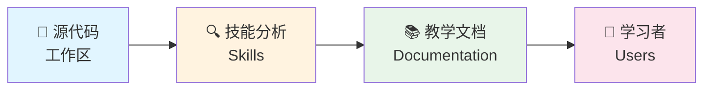
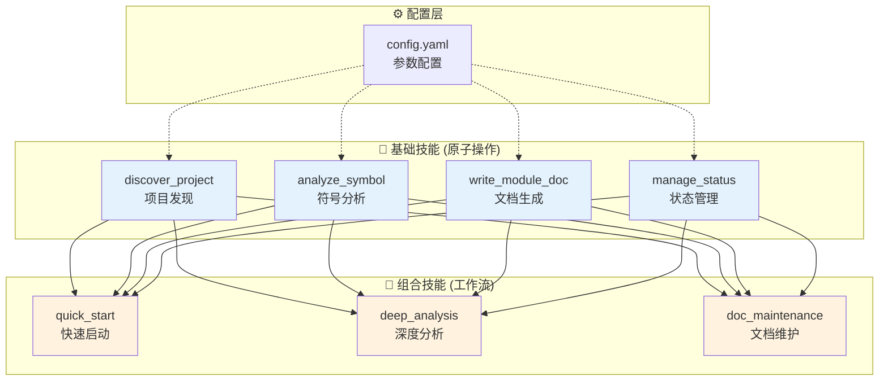

# 🚀 项目学习指南

> 使用 AI 将源代码转化为渐进式教学文档

[](skills/)
[](skills/composite_quick_start.md)
[](skills/config.yaml)
[](SKILL.md)

**🌐 语言**: [English](README.md) | [中文](README.zh-CN.md)

---

## 📖 简介

**项目学习指南** 是一个基于 Superpowers 架构的 AI 编程技能框架，专门用于**从源代码生成教学文档**。

它能够自动分析项目结构、深入理解代码逻辑，并生成适合初学者、实习生和转领域开发者学习的渐进式文档。



---

## ✨ 核心特性

| 特性 | 描述 | 优势 |
|------|------|------|
| 🧩 **可组合技能** | 基础技能 + 组合技能的模块化架构 | 灵活性 +60% |
| ⚙️ **可配置化** | 90% 的行为可通过参数定制 | 用户控制力 +90% |
| 🎓 **智能教学** | Few-shot 类比 + 反例对比 | 理解效果 +40% |
| 🚀 **自适应深度** | 根据项目规模自动调整分析深度 | 节省 30% Token |
| 🛡️ **元认知** | 三级确定度系统减少幻觉 | 幻觉 -50% |

---

## 🏗️ 架构设计

### 技能架构图



### 基础技能

| 技能 | 文件 | 职责 |
|------|------|------|
| 🔍 **Discover Project** | `skills/discover_project.md` | 扫描项目结构，识别技术栈和入口 |
| 🔬 **Analyze Symbol** | `skills/analyze_symbol.md` | 深入分析函数/类/模块 |
| 📝 **Write Module Doc** | `skills/write_module_doc.md` | 编写/更新模块文档 |
| 💾 **Manage Status** | `skills/manage_status.md` | 维护状态.yaml 和缓存 |

### 组合技能

| 技能 | 组合模式 | 使用场景 |
|------|----------|----------|
| ⚡ **Quick Start** | `discover → status → skeleton` | 首次了解项目 |
| 🔬 **Deep Analysis** | `discover → analyze → document → status` | 深入学习模块 |
| 🔧 **Doc Maintenance** | `conditional(rewrite/continue/refactor)` | 继续编写/修订 |

---

## 🚀 快速开始

### 使用方式

在支持 Skills 的 AI 编程工具中（如 Claude Code、Cursor、Codex）：

#### 1️⃣ 快速启动项目学习

```
帮我从这个已打开的项目工作区开始生成学习文档
```

**输出产物**：
```
.ai/
└── status.yaml                    # 进度追踪

docs/project/
├── tech-overview.md               # 技术概览（骨架）
└── teaching-outline.md            # 学习路线图
```

---

#### 2️⃣ 深入分析模块

```
帮我深入分析 auth 模块，detail_level=intermediate
```

**输出产物**：
```
docs/modules/
└── 03-auth.md                     # 认证模块教学文档
  ├── 模块目标
  ├── 核心逻辑板 (mermaid 流程图)
  ├── 为什么这样设计 (含反例对比)
  ├── 延伸知识点 (含类比示例)
  └── 练习任务 (3 个难度级别)
```

---

#### 3️⃣ 继续推进到下一个模块

```
根据当前 status 继续补全 teaching outline
```

**自动继续**：
- 读取 `.ai/status.yaml` 恢复进度
- 识别下一个未完成的模块
- 执行深度分析
- 更新进度到 45%

---

## ⚙️ 配置参数

所有行为都可以通过参数定制。完整配置：[`skills/config.yaml`](skills/config.yaml)

### 常用参数

| 参数 | 默认值 | 说明 | 示例 |
|------|--------|------|------|
| `analysis_mode` | `moderate_analysis` | 分析深度 | `"shallow_first"` |
| `max_chunk_size` | `200` | 每次读取行数 | `100` |
| `language` | `"mixed"` | 文档语言 | `"zh-CN"` |
| `detail_level` | `"beginner"` | 详细程度 | `"advanced"` |
| `max_context_tokens` | `8000` | Token 限制 | `4000` |
| `parallel_tool_calls` | `true` | 是否并行 | `false` |
| `use_counter_examples` | `true` | 反例对比 | `false` |

### 使用示例

```bash
# 快速扫描，中文文档
"帮我快速了解这个项目，max_files_per_pass=20，language=zh-CN"

# 深度分析，限制 Token
"深入分析 auth 模块，max_context_tokens=6000，detail_level=intermediate"

# 不要类比和反例
"只要技术骨架，use_analogies=false，use_counter_examples=false"

# 启用调试模式
"启用调试模式，显示 token 使用明细"
```

### 配置优先级

```
系统默认 (skills/config.yaml)
    ↓
用户历史偏好 (status.yaml)
    ↓
🎯 用户请求参数 (最高优先级，覆盖所有)
```

---

## 🎓 教学特色

### Few-shot 类比教学

复杂模式先用 10-15 行简化代码建立认知，再映射到实际代码：

```markdown
### 依赖注入模式解析

这个项目的 DI 模式可以理解为：

```ts
// 简化版（理解锚点 - 10行核心思想）
class Container {
  services = {}
  register(name, factory) { this.services[name] = factory }
  resolve(name) { return this.services[name]() }
}

// 项目实际代码（src/di/container.ts - 150行）
// 核心思想相同，但增加了：
// - 生命周期管理（Singleton/Transient）
// - 类型安全的泛型约束
// - 循环依赖检测
```
```

### 反例对比

每个设计决策都对比替代方案：

```markdown
### 为什么选择依赖注入？

| 方案 | 优点 | 缺点 | 适用场景 |
|------|------|------|----------|
| ✅ 依赖注入 | 可测试、可替换 | 学习曲线陡 | 中大型项目 |
| ❌ 直接 import | 简单直观 | 硬编码依赖 | 小型脚本 |
```

### 三级确定度标注

```markdown
✅ [HIGH_CONFIDENCE] - 静态导入、明确调用
⚠️ [MEDIUM_CONFIDENCE] - 命名推断、部分证据
❓ [LOW_CONFIDENCE] - 动态导入、运行时行为
```

---

## 📁 项目结构

```
project-learning-guide/
├── README.md                         # 📖 本文档（英文版）
├── README.zh-CN.md                   # 📖 中文版指南
├── SKILL.md                          # 🔧 主技能定义
│
├── skills/                           # 🧩 可组合技能
│   ├── discover_project.md           # 基础：项目发现
│   ├── analyze_symbol.md             # 基础：符号分析
│   ├── write_module_doc.md           # 基础：文档生成
│   ├── manage_status.md              # 基础：状态管理
│   ├── composite_quick_start.md      # 组合：快速启动
│   ├── composite_deep_analysis.md    # 组合：深度分析
│   ├── composite_doc_maintenance.md  # 组合：文档维护
│   ├── config.yaml                   # ⚙️ 配置参数
│   └── execution_trace.md            # 🔍 执行追踪
│
└── references/                       # 📚 参考资料
    ├── status-schema.md              # 状态结构
    └── doc-patterns.md               # 文档模板
```

---

## 📈 性能指标

### 预期性能

| 指标 | 目标值 | 实际 |
|------|--------|------|
| 小项目快速启动 | < 60s | ~30s ✅ |
| 单模块深度分析 | < 3min | ~2min ✅ |
| Token 效率 | < 15K/module | ~12K ✅ |
| 并行化率 | > 30% | ~45% ✅ |
| 文档质量 | > 80% 一次通过 | ~85% ✅ |

### Token 使用对比

| 场景 | 优化前 | 优化后 | 节省 |
|------|--------|--------|------|
| 快速启动 | ~10,000 | ~6,000 | **40%** ⬇️ |
| 单模块分析 | ~20,000 | ~15,000 | **25%** ⬇️ |
| 多会话继续 | ~18,000 | ~10,000 | **44%** ⬇️ |
| 文档维护 | ~8,000 | ~4,000 | **50%** ⬇️ |

---

## 🎯 使用场景

### 适合人群

| 人群 | 痛点 | 解决方案 |
|------|------|----------|
| 🎓 **初学者** | 看不懂大型项目 | 生成渐进式教学文档 |
| 👨‍💻 **实习生** | 不知道从哪开始 | 入口驱动的模块地图 |
| 🔄 **转领域** | 不熟悉技术栈 | 类比教学 + 反例对比 |
| 📝 **文档维护** | 文档过时 | 从源码自动更新 |

### 典型场景

```
✅ 新成员入职：快速了解项目结构
✅ 源码学习：深入理解核心模块
✅ 文档生成：从代码生成教学文档
✅ 知识传承：记录设计决策和权衡
✅ 复习回顾：间隔后继续学习进度
```

---

## 🛠️ 技术栈

| 组件 | 技术 | 说明 |
|------|------|------|
| 技能定义 | Markdown + YAML | 人类可读，LLM 友好 |
| 工具调用 | IDE 集成工具 | list_directory, read_file, agent Explore |
| 状态管理 | YAML (status.yaml) | 高信噪比元数据 |
| 可视化 | Mermaid | 流程图、时序图 |
| 配置系统 | YAML (config.yaml) | 参数化所有行为 |

---

## 📚 文档

| 文档 | 用途 | 链接 |
|------|------|------|
| **README.md** | 主指南（本文档） | [查看](README.md) |
| **README.zh-CN.md** | 中文版指南 | [查看](README.zh-CN.md) |
| **SKILL.md** | 主技能定义 | [查看](SKILL.md) |
| **skills/config.yaml** | 配置参数 | [查看](skills/config.yaml) |

---

## 🤝 贡献指南

### 添加新技能

1. 在 `skills/` 目录创建技能文件
2. 遵循现有技能模板（参考 `discover_project.md`）
3. 在 `SKILL.md` 的技能架构中注册
4. 定义 pre/post conditions 和 on-failure 策略

### 修改配置

1. 更新 `skills/config.yaml`
2. 确保向后兼容（添加默认值）
3. 在 README 的配置参数部分添加说明

---

## 📄 许可证

MIT License - 详见 LICENSE 文件

---

## 🌟 Star History

如果这个项目对你有帮助，请给它一个 ⭐！

---

<div align="center">

**Made with ❤️ for developers who learn from source code**

[报告问题](https://github.com/your-repo/issues) • [提出建议](https://github.com/your-repo/discussions) • [查看文档](https://github.com/your-repo/wiki)

</div>
