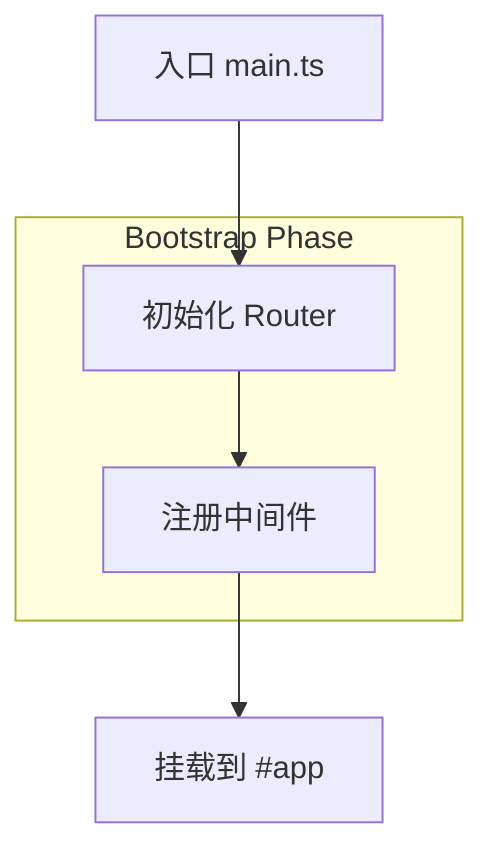

# Project Learning Guide

## Overview

Use this skill to study a project from source code and produce teaching-oriented documentation incrementally. Work from the workspace that is already open in the IDE. Prefer entry-driven exploration, high-signal status tracking, anchored markdown rewrites, and pause after each completed module document.

## Skill Architecture

This skill follows **composable skill architecture** inspired by Superpowers framework. Skills are organized into base skills (atomic operations) and composite skills (orchestrated workflows).

### Base Skills (Atomic Operations)
Located in `skills/` directory:
- **`discover_project`** (`skills/discover_project.md`): Discover and map project structure
- **`analyze_symbol`** (`skills/analyze_symbol.md`): Deep-dive analysis of specific symbols
- **`write_module_doc`** (`skills/write_module_doc.md`): Write/update module documents
- **`manage_status`** (`skills/manage_status.md`): Maintain status.yaml and context cache

### Composite Skills (Orchestrated Workflows)
- **`quick_start`** (`skills/composite_quick_start.md`): Discover + skeleton → fast start
- **`deep_analysis`** (`skills/composite_deep_analysis.md`): Discover + analyze + document → module deep-dive
- **`doc_maintenance`** (`skills/composite_doc_maintenance.md`): Status + update + anchor management

### Skill Composition Patterns

#### Sequential Composition
```yaml
quick_start:
  - discover_project → project_map
  - manage_status (initialize) → status
  - write_module_doc (skeleton) → tech-overview.md
```

#### Conditional Composition
```yaml
doc_maintenance:
  if anchor_update_requested → rewrite_anchor
  if continue_requested → deep_analysis
  if refactor_requested → patch_sections
```

#### Parallel Optimization
Within skills, maximize parallel tool calls:
- Read multiple configs in parallel
- Glob multiple entry patterns in parallel
- Analyze independent symbols in parallel

## Operating principles

- Treat the open workspace as the source of truth.
- Start small and ask a few calibration questions before heavy generation when the learner's level or goal is unclear.
- Prefer incremental updates over full rewrites.
- Keep `status.yaml` extremely high-signal: metadata only, never long code or long prose.
- Produce teaching content for weak-to-mid foundation learners, interns, fresh graduates, and domain-switching developers.
- Explain **Why** the code is written this way, not just **What** it does.
- Use mermaid for structural views when it helps. Prefer `flowchart` over `sequenceDiagram`. Wrap every node label in double quotes.

## Configuration and Parameter Control

All skill behaviors can be customized via configuration parameters. See `skills/config.yaml` for defaults and full parameter list.

### User Override Syntax

Users can specify parameters in requests to control skill behavior:

**Analysis depth**:
- "使用 deep_analysis 模式，max_chunk_size=100"
- "快速扫描，max_files_per_pass=10"

**Documentation style**:
- "生成中文文档，language=zh-CN"
- "高级教程，detail_level=advanced"
- "不要 mermaid 图，mermaid_threshold=999"

**Performance**:
- "不要并行，parallel_tool_calls=false"
- "这次不用缓存，cache_enabled=false"

**Teaching strategy**:
- "不需要练习，min_practice_tasks=0"
- "不要反例对比，use_counter_examples=false"

**Output format**:
- "用表格代替流程图，prefer_mermaid=false"
- "这次全量重写，use_anchors=false"

### Configuration Priority

1. System defaults (`skills/config.yaml`)
2. User's previous preferences (stored in status.yaml)
3. **User request parameters** (highest priority, overrides all)

### Common Parameter Combinations

```yaml
# Quick exploration
{
  "analysis_mode": "shallow_first",
  "max_files_per_pass": 20,
  "detail_level": "beginner",
  "use_counter_examples": false
}

# Deep technical study
{
  "analysis_mode": "deep_analysis",
  "detail_level": "advanced",
  "max_snippet_length": 30,
  "min_practice_tasks": 5
}

# Maintenance mode
{
  "parallel_tool_calls": false,
  "cache_enabled": true,
  "use_analogies": true
}
```

## Complexity-adaptive analysis depth

Dynamically adjust analysis depth based on project scale and module complexity to optimize token usage and avoid context overflow.

### Assess project scale early

Count files and directories after initial `list_directory`:
- **Small project** (< 50 files) → use `deep_analysis` mode: can analyze more code in one pass, fewer pauses
- **Medium project** (50-200 files) → use `moderate_analysis` mode: process module by module
- **Large project** (> 200 files) → use `shallow_first` mode: skeleton first, then ask user which direction to dive deep

Record the chosen mode in status under `analysis_mode`.

### Dynamic chunk_size for code reading

Adjust how much code to read at once based on complexity:
- **Simple modules** (utility functions, configs, types) → read 200-300 lines per chunk
- **Complex modules** (core business logic, state management, orchestration) → read 50-100 lines per chunk
- **Ultra-complex files** (>1000 lines) → split by function/class/symbol, analyze one at a time

### Scale heuristics

If any single file exceeds 800 lines or has >10 imports/exports, mark it as `high_complexity` in status and reduce chunk_size automatically.

## Tool strategy

Use the IDE-integrated tools with this priority order.

1. `list_directory` first to establish structure.
2. `read_file` for README, config, entry files, and focused source chunks.
3. Prefer IDE symbol-aware capabilities through `agent` with `Explore` for symbol parsing, definition tracing, and import graph reasoning.
4. Use `glob` to locate likely entrypoints and route files.
5. Use `grep_search` only for targeted confirmation, not blind repo-wide dumping.
6. Use `edit` or `write_file` for targeted document/status updates.
7. Use `run_shell_command` only when you need deterministic assembly or lightweight validation.

Never start by blindly traversing the whole repository.

### Tool parallelization strategy

Maximize efficiency by parallelizing independent tool calls when there is no dependency between them.

**Parallel-safe scenarios** (no dependency, can run together):
- Read multiple config files together: `package.json` + `tsconfig.json` + `vite.config.ts`
- Read multiple entry files together: `main.ts` + `app.ts` + `router/index.ts`
- Search for multiple independent symbols or patterns
- Run multiple `glob` searches for different file patterns

**Must be sequential** (output of A needed for input of B):
- `list_directory` → decide which files to `read_file` (depends on structure)
- `read_file` → decide what to `grep_search` (depends on content)
- `glob` → `read_file` matched files (depends on glob results)

**Example optimized flow**:
1. `list_directory` (1 call)
2. Parallel: read `package.json` + `README.md` + `tsconfig.json` (3 calls in parallel)
3. Parallel: `glob **/main.ts` + `glob **/index.ts` (2 calls in parallel)
4. Based on results, parallel read multiple entry files

## Metacognition and confidence annotation

LLM must explicitly annotate certainty level for each conclusion to reduce hallucination and guide user verification.

### Confidence levels

After each analytical conclusion, annotate with one of:

- ✅ **HIGH_CONFIDENCE** (static import, clear function call, explicit code pattern)
  - Example: "该模块使用 Factory Pattern [HIGH_CONFIDENCE] - 依据：src/factory.ts 中 createInstance() 根据 type 参数返回不同实现"

- ⚠️ **MEDIUM_CONFIDENCE** (inferred from naming, indirect call, partial evidence)
  - Example: "路由采用懒加载 [MEDIUM_CONFIDENCE] - 依据：routes.ts 中使用 import() 语法，推测为动态加载"

- ❓ **LOW_CONFIDENCE** (dynamic import, reflection, plugin system, runtime-only behavior)
  - Example: "认证中间件在此处注册 [LOW_CONFIDENCE] - 依据：配置文件中引用了 auth 模块，但实际注册逻辑在运行时动态执行"

### When to use which level

**HIGH_CONFIDENCE** when:
- Direct import statement exists
- Function call chain is clear
- Code pattern is explicit and unambiguous

**MEDIUM_CONFIDENCE** when:
- Inferring from file/module naming conventions
- Indirect calls through registries or maps
- Partial evidence, reasonable assumption

**LOW_CONFIDENCE** when:
- Dynamic import() or require()
- Reflection, metaprogramming, or plugin systems
- Runtime-only behavior not statically confirmable
- Configuration-driven behavior that depends on external state

### Documentation requirement

In module docs, add a "Confidence Notes" subsection when MEDIUM or LOW confidence conclusions exist:

```md
## Confidence Notes
- ⚠️ Module registration inferred from naming convention; actual runtime registration may differ
- ❓ Plugin loading uses dynamic import(); exact modules loaded depend on config at runtime
```

In status.yaml, record LOW_CONFIDENCE items under `unresolved_questions` for later verification.

## Entry-driven workflow

Follow this sequence.

### 1) Calibrate teaching scale

Ask a small number of questions when missing:
- learner level
- target role or domain
- source-reading depth vs project-practice preference
- resume-oriented vs deep technical understanding

Do not over-question. If the user already provided this context, proceed.

### 2) Build the first-pass project map

1. Read the root `README` first.
2. Run `list_directory` on the project root.
3. Read ecosystem-specific config files to infer stack and runtime, such as:
   - Node: `package.json`, `tsconfig.json`, `vite.config.*`, `next.config.*`
   - Python: `pyproject.toml`, `requirements.txt`, `manage.py`, `app.py`
   - Java: `pom.xml`, `build.gradle*`
   - Go: `go.mod`
   - Rust: `Cargo.toml`
4. Use `glob` to locate lifecycle entry files and route registration files.
5. Use `agent` with `Explore` to prefer symbol parsing and import-relationship reasoning over raw file-by-file crawling.
6. Infer module responsibilities backward from entry imports.
7. If imports are dynamic, annotate them as `runtime_resolved` instead of guessing.

If README is weak or missing, mark `readme_insufficient: true` in status and fall back to config + lifecycle entry analysis.

### 3) Draft the technical skeleton only

Create or update the technical overview as a skeleton first. Do **not** fill all details at once.

Default path layout:
- `.ai/status.yaml`
- `docs/project/tech-overview.md`
- `docs/project/teaching-outline.md`
- `docs/modules/01-startup-bootstrap.md`

Required skeleton sections for `tech-overview.md`:
- Project Goal
- Tech Stack and How to Run
- Entry and Lifecycle
- Module Map
- Core Execution Flow
- Key Patterns and Data Structures
- Open Questions
- Anchor Zone

Add anchors for sections that will be refined later, for example:

```md
<!-- ANCHOR: entry-lifecycle -->
...
<!-- ANCHOR: module-map -->
...
<!-- ANCHOR: routing-flow -->
```

### 4) Maintain status as AOP-style metadata

Always keep `.ai/status.yaml` in YAML. Read it at the start of each substantial turn as system context if present.

Rules:
- Store metadata only.
- Never store long analysis, code blocks, or long prose.
- For completed modules, keep exactly one short line per module in `completed_modules`.
- Store only IDs for unresolved questions, not full essays.
- Detailed reasoning belongs in markdown docs, not in status.

Required fields:

```yaml
project_type: "frontend-react | backend-node | ai-llm | ..."
phase: "scoping | skeleton | outlining | module-writing | refining"
progress: 0
current_focus: "entry-lifecycle"
analysis_mode: "deep_analysis | moderate_analysis | shallow_first"
key_files:
  - "src/main.ts"
  - "src/router/index.ts"
completed_modules:
  - "startup bootstrap"
question_ids:
  - "Q1"
anchors_touched:
  - "entry-lifecycle"
doc_paths:
  tech_overview: "docs/project/tech-overview.md"
  teaching_outline: "docs/project/teaching-outline.md"
  modules_dir: "docs/modules"
runtime_resolved:
  - "src/modules/registry.ts -> dynamic import()"
readme_insufficient: false
```

### Context cache for LLM efficiency (optional but recommended)

To avoid re-analyzing already-understood code across sessions, add these fields when beneficial:

```yaml
# Context cache - stores already-analyzed symbols to save tokens
llm_context:
  analyzed_symbols:
    - name: "AuthService"
      file: "src/auth/service.ts"
      summary: "处理认证逻辑，依赖 HTTPClient"
      confidence: "HIGH"
    - name: "Router"
      file: "src/router/index.ts"
      summary: "路由配置，使用懒加载"
      confidence: "HIGH"
  
  reasoning_cache:
    Q1_auth_flow: "已分析完毕，结论见 docs/modules/03-auth.md"
    Q2_routing: "已确认使用 Vue Router 4"
  
  attention_hotspots:
    - "src/auth/**"
    - "src/store/**"
```

**Rules for context cache**:
- Update `analyzed_symbols` after completing analysis of a key module
- Use `reasoning_cache` to store IDs of already-derived conclusions (avoid re-deriving)
- Use `attention_hotspots` to track current focus areas for next session
- Keep summaries under 20 words per symbol
- Remove symbols from cache if files are deleted or significantly changed

**When to use context cache**:
- Project has > 100 files (avoid re-scanning)
- Multiple sessions working on different modules
- User asks to "continue from last time"

**When NOT to use**:
- Small projects (< 50 files) - not worth the overhead
- First session - nothing to cache yet

### 5) Build the dual-track teaching outline

Create `docs/project/teaching-outline.md` as the navigation index.

Use two tracks together:
- **Main track**: execution flow from entrypoint to downstream modules
- **Side track**: extended knowledge points required to understand the code

Every side-track item must explicitly answer:
- which design pattern, data structure, lifecycle concept, or engineering decision in the source it explains
- where in the source this appears

Recommended outline block:

```md
## Module 01 - Startup Bootstrap
- Main track: how the app starts from `src/main.ts`
- Side track: why dependency injection / plugin registration exists here
- Source target: `src/main.ts`, `src/app.ts`
- Explains: bootstrap pattern, inversion of control, initialization ordering
- Output doc: `docs/modules/01-startup-bootstrap.md`
```

### 6) Write one module at a time

For each module document, use the fixed structure:
- Module Goal
- Position in Main Execution Flow
- Key Source Locations
- Core Logic Board
- Why This Design
- Extended Knowledge Points
- Practice Tasks
- Questions and Boundaries

Constraints:
- Do not paste the full source file.
- Show only minimal core snippets when necessary.
- Always point to exact file path and symbol name.
- Favor explanation of intent, trade-offs, and design pressure.

#### Few-shot analogy teaching strategy

When explaining complex patterns or architectures, **always** provide a simplified analogy example first.

**Rule**: 10-15 line simplified code → map to actual complex code

**Example format**:
```md
### 依赖注入模式解析

这个项目的 DI 模式可以理解为：

```ts
// 简化版（理解锚点 - 10行核心思想）
class Container {
  services = {}
  register(name, factory) { this.services[name] = factory }
  resolve(name) { return this.services[name]() }
}

// 项目实际代码（src/di/container.ts - 150行）
// 核心思想相同，但增加了：
// - 生命周期管理（Singleton/Transient）
// - 类型安全的泛型约束
// - 循环依赖检测
```
"
```

**When to use few-shot analogies**:
- Design patterns (Factory, DI, Observer, etc.)
- Complex data structures (trees, graphs, state machines)
- Lifecycle flows (app bootstrap, request pipeline)
- Architecture patterns (middleware, plugins, layers)

**Analogy rules**:
- Keep simplified version under 15 lines
- Use familiar concepts (plain objects, simple functions)
- Explicitly state "what's the core idea" vs "what's engineering enhancement"
- Point to exact actual code location after the analogy

#### Counter-example comparison (Why Not analysis)

In "Why This Design" sections, **always** include comparison with alternatives.

**Required format**:

```md
### 为什么选择依赖注入？

| 方案 | 优点 | 缺点 | 适用场景 |
|------|------|------|----------|
| ✅ 当前：依赖注入 | 可测试、可替换、易 mock | 学习曲线陡、初始配置复杂 | 中大型项目 |
| ❌ 替代：直接 import | 简单直观、零配置 | 硬编码依赖、难以测试 | 小型脚本、工具 |
```

**Include code contrast when helpful**:
```md
"如果不使用 DI 而直接 import：

```ts
// ❌ 硬编码依赖（难以测试、违反依赖倒置原则）
import { Database } from './db'
class UserService { db = new Database() }

// ✅ 依赖注入（可替换、可测试、依赖倒置）
class UserService {
  constructor(private db: IDatabase) {}  // 可注入 mock
}
```

**对比要点**：
- 当前方案解决了什么问题？（可测试性）
- 替代方案在什么情况下可以接受？（快速原型）
- 代价是什么？（增加了抽象层）"
```

**When to include counter-examples**:
- When explaining architectural decisions
- When a design pattern has obvious alternatives
- When trade-offs are non-obvious
- When learners might wonder "why not just do X?"

### 7) Use anchored incremental updates

Do not rewrite full docs unless the structure is broken.

When refining a section, use instructions of this form:

> Read the relevant source, and rewrite only the content between `<!-- ANCHOR: auth-middleware -->` and the next anchor. Keep surrounding connective wording unchanged.

Allowed update modes:
- append one new section
- rewrite one anchored block
- patch one subsection

Disallowed update mode:
- full-document regeneration by default

### 8) Read code in chunks

Read code by module, symbol, or function-sized chunks. After each chunk:
1. update only the corresponding anchored section in the technical doc
2. update the matching module or outline section
3. update status metadata

If assembly is needed, use a lightweight script or tooling step, but keep source analysis chunked.

## Analysis mode switching

Switch analysis mode based on user intent and project characteristics. Record current mode in status under `analysis_mode`.

### Available modes

**SKIM_MODE** (快速浏览模式):
- **When**: User wants quick overview, or project is too large for deep dive
- **What**: Only read directory structure + config files + entry points
- **Output**: Project map with module names and relationships, no deep code analysis
- **Depth**: 1-2 levels deep from entry points
- **Time**: Fast, minimal token usage

**DEEP_DIVE_MODE** (深度分析模式):
- **When**: User wants to understand a specific module in detail
- **What**: Read functions/classes one by one, trace call chains, analyze patterns
- **Output**: Detailed module doc with core logic board, design rationale, examples
- **Depth**: Full depth for target module, shallow for dependencies
- **Time**: Slow, high token usage per module

**CROSS_CUTTING_MODE** (跨模块追踪模式):
- **When**: User wants to trace a concept across multiple modules (e.g., "how does auth work?")
- **What**: Search for specific symbols/patterns across the codebase, trace data flow
- **Output**: Cross-cutting concern document showing all related code locations
- **Depth**: Follow the concept, skip unrelated code
- **Time**: Medium, depends on concept spread

### Mode selection heuristics

- If user says "帮我了解这个项目" → start with SKIM_MODE, then ask which area to DEEP_DIVE
- If user says "帮我深入分析 XX 模块" → use DEEP_DIVE_MODE on that module
- If user says "我想了解认证/路由/状态管理是怎么工作的" → use CROSS_CUTTINGMODE for that concept
- If project > 200 files → default to SKIM_MODE first, then let user choose dive targets
- If project < 50 files → can start with DEEP_DIVE_MODE directly

### Mode switching during workflow

Example flow:
1. SKIM_MODE → generate project map
2. User chooses "auth module" → switch to DEEP_DIVE_MODE
3. User asks "where else is auth used?" → switch to CROSS_CUTTINGMODE
4. Record mode changes in status for session continuity

## Project-type heuristics

Infer a coarse `project_type` early because it changes entry discovery and teaching framing.

Suggested buckets:
- `frontend-react`
- `frontend-vue`
- `frontend-next`
- `backend-node`
- `backend-python`
- `backend-java`
- `backend-go`
- `ai-llm`
- `rag-system`
- `training-pipeline`
- `cli-tool`
- `library`
- `fullstack`

Use config files, runtime scripts, root folders, and entry imports to decide. If uncertain, record the best guess and note uncertainty in the markdown docs, not in status prose.

## API-style modular contract

Use this API-documentation style inside your reasoning and output planning.

### `discover_project_map(workspace_root) -> {project_type, entry_candidates, route_candidates, key_files, runtime_resolved}`
- Read README and root structure.
- Identify ecosystem and candidate entrypoints.
- Use symbol-aware exploration when possible.
- Return only high-signal structure.

### `initialize_status(workspace_root, project_map) -> {status_update}`
- Create `.ai/status.yaml` if missing.
- Populate metadata scaffold.
- Keep values concise.

### `draft_tech_skeleton(project_map, learner_profile) -> {doc_update, anchors}`
- Create the overview skeleton only.
- Add anchor placeholders for later refinement.
- Do not prematurely over-explain.

### `build_teaching_outline(project_map, learner_profile, focus_pattern) -> {doc_update, status_update}`
- Build the dual-track outline.
- Map every side-track item to a source design choice.
- Update outline progress in status.

### `analyze_module(source_paths, focus_pattern) -> {doc_update, status_update}`
- Read the minimal chunk set needed for one module.
- Update the corresponding module markdown.
- Update only the touched anchors and metadata.

### `rewrite_anchor(doc_path, anchor_name, source_paths) -> {doc_update}`
- Rewrite only the anchored block.
- Preserve surrounding text and headings.
- Do not modify unrelated sections.

### `finalize_module(module_doc_path) -> {status_update, user_gate}`
- Ensure the module doc is coherent and teaching-oriented.
- Update progress and completed module line.
- End the response with the exact final line:

```text
[STATUS: WAITING_FOR_USER_CONFIRMATION]
```

This line is the task-completion sentinel for a module turn. Do not omit it. Do not add any text after it.

#### Quality self-check checklist (MUST run before finalize)

Before marking a module as complete, **self-check** against this checklist. If any item is NO, fix it before outputting the final status.

```md
Quality Checklist:
- [ ] 是否包含完整文件路径和符号名？（如 `src/auth/service.ts` - `AuthService.login()`）
- [ ] 是否避免了大段代码粘贴？（单段代码 < 20 行，除非绝对必要）
- [ ] 是否解释了设计意图（Why）而不仅是功能（What）？
- [ ] 是否标注了确定度？（HIGH/MEDIUM/LOW_CONFIDENCE）
- [ ] 是否提供了练习任务？（至少 2-3 个由易到难的任务）
- [ ] 是否有类比或简化示例？（对复杂模式使用 few-shot analogy）
- [ ] 是否有反例对比？（Why This Design 包含替代方案对比）
- [ ] 是否使用了 mermaid 流程图？（当模块关系 > 3 个时）
- [ ] 是否 mermaid 节点都用双引号包裹？（如 `A["label"]`）
- [ ] 是否引用了正确的锚点区域？（anchors_touched 已更新）
- [ ] 是否更新了 status.yaml？（progress、completed_modules、anchors_touched）
```

**Auto-fix rules** (if checklist fails):
- If no confidence annotation → add it based on analysis certainty
- If no few-shot analogy for complex pattern → add a simplified example
- If no counter-example → add "Why Not" comparison table
- If mermaid missing for >3 module relationships → add flowchart
- If code block > 20 lines → split into smaller chunks with explanations
- If no practice tasks → generate 3 tasks (basic, intermediate, challenge)

## Output requirements

- Write markdown documents in mixed Chinese and English where useful.
- Prefer concise, structured explanations.
- Use mermaid `flowchart` for flow and relationship views.
- Wrap every mermaid node label in double quotes.
- Use markdown tables only when a flowchart would be unnatural.
- For code-teaching sections, prefer a core logic board with source pointers, not full file dumps.

### Mermaid intelligent triggering rules

Use mermaid diagrams strategically to enhance understanding, not decoratively.

**Must use mermaid when**:
- Module call relationships > 3 modules (shows architecture clearly)
- Data flow has multiple stages (e.g., request → middleware → handler → response)
- State machine or lifecycle process (e.g., auth flow, connection lifecycle)
- Module dependency graph (shows which depends on which)

**Should use mermaid when**:
- Execution order is non-obvious from code structure
- Multiple entry points converge to same handler
- Event-driven or pub/sub patterns

**Should NOT use mermaid when**:
- Simple linear flow (text is clearer)
- Only 1-2 modules involved (overhead not worth it)
- Highly dynamic/runtime-dependent flow (diagram would be misleading)

**Mermaid format rules**:


- Always use `flowchart TD` (top-down) or `flowchart LR` (left-right)
- Wrap ALL node labels in double quotes: `A["label text"]`
- Use `subgraph` for grouping related steps
- Keep labels concise (< 20 characters when possible)
- Add comments if flow needs explanation

## Fallbacks and cautions

- If symbol parsing is unavailable, fall back to `glob` + focused `read_file` + targeted `grep_search`.
- If dynamic registration or plugin loading hides structure, mark it in `runtime_resolved` and continue with best-known static structure.
- If the project is too large, keep the first pass at skeleton level and choose only one next module.
- Never let status become a second documentation file.
- Never claim certainty about runtime-only behavior that was not statically confirmed.

## Error handling and resilience

### Corrupted or malformed status.yaml

If `.ai/status.yaml` exists but is unreadable or structurally broken:

1. Attempt to parse. If parsing fails, rename it to `.ai/status.yaml.bak.<timestamp>`.
2. Log the reason in a short note at the top of the next response.
3. Regenerate a minimal scaffold from scratch using the current workspace state.
4. Continue the workflow from the `scoping` or `skeleton` phase, whichever matches observed progress.

If status exists but has missing fields:
- Fill missing fields with safe defaults.
- Set `phase` to `scoping` if uncertain.
- Set `progress` to `0` if no completed modules are detectable.

### Missing or inaccessible files

- If a key file referenced in `key_files` or `completed_modules` no longer exists, remove it from status and note in the doc under `Questions and Boundaries`.
- Do not halt the workflow for a single missing non-critical file.

### Workspace too large or complex

- Scope down to one directory or one sub-project at a time.
- Treat each sub-project as an independent `project_type` with its own status scaffold under `.ai/<sub-project>/status.yaml` if needed.
- Record the scoping decision in status under a `scope_note` field.

## Boundaries and permissions

### File operations

- **Allowed**: create or edit files under `.ai/`, `docs/`, and module directories.
- **Allowed**: create `status.yaml`, `tech-overview.md`, `teaching-outline.md`, and module documents.
- **Disallowed**: modify source code files (`src/`, `lib/`, `app/`, etc.) unless the user explicitly requests a code change.
- **Disallowed**: delete user-created files. If a file must be replaced, overwrite content rather than delete-and-recreate.
- **Disallowed**: touch `.git/`, `node_modules/`, `__pycache__/`, `.venv/`, `target/`, or any build artifact directory.

### Shell commands

- Use `run_shell_command` only for read-only operations (e.g., `ls`, `git log --oneline`) or lightweight validation (e.g., `npm run lint -- --dry-run`).
- Never run destructive or irreversible commands (`rm -rf`, `git reset --hard`, `npm install --force`) without explicit user approval.
- If a command fails, capture stderr, report the error concisely, and proceed with fallback analysis.

## Cross-skill integration

This skill may coordinate with other skills when beneficial:

- **`review`**: After writing a module document, optionally invoke `review` to check document quality, completeness, and teaching clarity.
- **`loop`**: For long-running projects, use `loop` to periodically re-analyze the workspace and update docs when source code changes (e.g., after a git pull or commit).
- **`qc-helper`**: Use `qc-helper` to answer questions about the IDE or tool configuration that affect how this skill operates.

Trigger cross-skill calls only when the user benefits from them. Do not chain skills gratuitously.

## Multi-language and monorepo heuristics

When the workspace contains multiple languages or sub-projects:

1. **Detect boundaries early**: identify sub-project roots by looking for package managers, build configs, or directory conventions (e.g., `packages/`, `apps/`, `services/`).
2. **One skill run per sub-project**: treat each sub-project as an independent analysis target with its own `project_type`, `status.yaml`, and doc tree.
3. **Cross-project dependencies**: if sub-project A imports from sub-project B, annotate the relationship in A's module doc under a `Cross-project dependency` note and point to B's doc.
4. **Shared config**: if a root-level config governs multiple sub-projects (e.g., a root `tsconfig.json` with `references`), record it in status under `shared_config` and reference it in each sub-project's overview.
5. **Mixed-language files**: if a single directory mixes languages (e.g., `.py` and `.ts` side by side), prioritize the dominant language inferred from file count, entry points, and config files. Note the secondary language in status under `secondary_stack`.

## Version and iteration management

### Incremental runs

Each run of this skill is stateless except for `.ai/status.yaml`. On each invocation:

1. Read `status.yaml` to resume from the last known phase and focus.
2. Continue from `current_focus` or ask the user what to target next.
3. Update `progress`, `phase`, `completed_modules`, and `anchors_touched` after each meaningful change.

### Progress semantics

- `progress` is an integer from `0` to `100`, representing approximate completion of the teaching doc set.
- Increment by `10-20` per completed module, depending on module depth.
- Do not set `progress` to `100` until all planned modules are written and the teaching outline is complete.

### Doc versioning

- Do not create numbered or timestamped versions of docs (e.g., `tech-overview.v2.md`). Always update the canonical file in place.
- If a user wants to compare before/after, suggest a git diff instead of maintaining duplicate doc files.
- If a major structural overhaul is needed, create a temporary branch or copy with a `.bak` suffix, perform the rewrite, then replace the original after user review.

## Example trigger prompts

- 帮我从这个已打开的项目工作区开始生成学习文档
- 继续推进到下一个模块
- 先读 README 和入口文件，帮我做源码教学骨架
- 只重写 `<!-- ANCHOR: routing-flow -->` 这一段
- 根据当前 status 继续补全 teaching outline

## Execution Trace and Debugging

This skill supports execution tracing for observability and debugging. See `skills/execution_trace.md` for full specification.

### Enable Debug Mode

User can request debug output:
- "启用调试模式" / "Enable debug mode"
- "输出执行追踪" / "Show execution trace"
- "显示 token 使用明细" / "Show token usage breakdown"
- "为什么选择这个分析深度？" / "Why this analysis mode?"

### Debug Output Includes

When debug mode is enabled:
1. **Execution Timeline**: Skill execution sequence with duration
2. **Token Usage Breakdown**: Token consumption by phase
3. **Confidence Distribution**: HIGH/MEDIUM/LOW ratio
4. **Tool Call Details**: Detailed tool call sequence
5. **Cache Status**: Cache hit/miss statistics
6. **Error Diagnostics**: If errors occurred, full context

### Trace Storage

Traces are stored in `.ai/traces/` directory (created on demand):
```
.ai/
├── status.yaml
├── traces/
│   ├── 20260414-001.yaml
│   └── latest.yaml
└── docs/
```

### Trace Properties
- **Optional**: Only stored if user requests debug mode
- **Append-only**: Never modify old traces
- **Self-contained**: Include all context for debugging
- **Privacy-respecting**: No source code, only metadata
- **Small**: < 10KB each, cleanup after 100 traces
