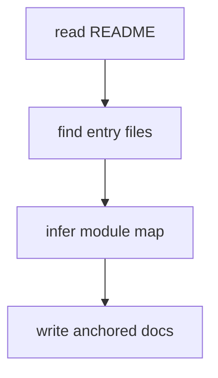

# Documentation Patterns

## Technical overview skeleton

Use this as a sparse scaffold, not a filled report.

```md
# Project Technical Overview

## Project Goal
<!-- ANCHOR: project-goal -->

## Tech Stack and How to Run
<!-- ANCHOR: tech-stack-run -->

## Entry and Lifecycle
<!-- ANCHOR: entry-lifecycle -->

## Module Map
<!-- ANCHOR: module-map -->

## Core Execution Flow
<!-- ANCHOR: core-execution-flow -->

## Key Patterns and Data Structures
<!-- ANCHOR: key-patterns-data-structures -->

## Open Questions
<!-- ANCHOR: open-questions -->
```

## Teaching outline pattern

```md
# Teaching Outline

## Learning calibration
- learner level:
- target direction:
- source-reading vs practice:
- resume vs deep dive:

## Module 01 - Startup Bootstrap
- Main track:
- Side track:
- Source target:
- Explains:
- Output doc:
```

## Module doc pattern

```md
# Module 01 - Startup Bootstrap

## 模块目标 | Module Goal

## 主线位置 | Position in Main Execution Flow

## 关键源码位置 | Key Source Locations
- `src/main.ts` - `bootstrap()`

## 核心逻辑板 | Core Logic Board

## 为什么这样设计 | Why This Design

## 延伸知识点 | Extended Knowledge Points

## 练习任务 | Practice Tasks

## 疑问与边界 | Questions and Boundaries
```

## Mermaid rule

Prefer flowchart.


