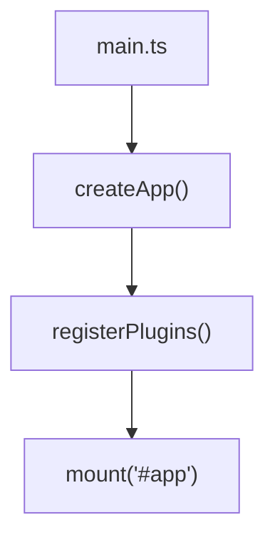

# Skill: Write Module Doc

## Purpose
编写或更新单个模块的教学文档。支持锚点增量更新，遵循固定结构和质量标准。

## Pre-conditions
```yaml
required:
  - module_analysis: "symbol_analysis output from analyze_symbol"
  - teaching_outline_exists: "docs/project/teaching-outline.md"
optional:
  - existing_doc: "docs/modules/XX-module-name.md"  # 如果存在，执行更新而非重写
  - learner_profile: "beginner | intermediate | advanced"
```

## Execution Steps

### 1. Determine Update Mode
Check existing doc:
- **If no doc exists** → full write mode
- **If doc exists with anchors** → anchored rewrite mode
- **If doc exists without anchors** → suggest adding anchors, then patch mode

### 2. Generate Content Structure
Use fixed template:
```markdown
# Module XX - {Module Name}

## 模块目标 | Module Goal

## 主线位置 | Position in Main Execution Flow

## 关键源码位置 | Key Source Locations
- `{file_path}` - `{symbol_name}`

## 核心逻辑板 | Core Logic Board

## 为什么这样设计 | Why This Design

## 延伸知识点 | Extended Knowledge Points

## 练习任务 | Practice Tasks

## 疑问与边界 | Questions and Boundaries
```

### 3. Fill Sections (with quality rules)

#### Module Goal
- 1-2 sentences, outcome-focused
- Example: "理解应用启动流程和依赖注入初始化"

#### Position in Main Execution Flow
- Reference teaching outline
- Show mermaid snippet of position in flow

#### Key Source Locations
- Exact file paths + symbol names
- NO code dumps, only pointers

#### Core Logic Board
- Use mermaid flowchart if > 3 components
- OR use table for data flow
- Keep under 15 lines of code if showing snippets

#### Why This Design
- **Must include**: counter-example comparison table
- **Must include**: trade-offs analysis
- **Must include**: what problem it solves

#### Extended Knowledge Points
- Link to side-track items from teaching outline
- Provide few-shot analogy for complex patterns
- Annotate confidence levels

#### Practice Tasks
- 3 tasks: basic → intermediate → challenge
- Each task should be actionable and testable

#### Questions and Boundaries
- Record LOW_CONFIDENCE items
- Note runtime-dependent behaviors
- Suggest further reading

### 4. Apply Teaching Strategies

#### Few-shot Analogy (for complex patterns)
```markdown
### 设计模式解析

简化版（理解锚点 - 10-15 行）：
{simple code example}

实际代码（{file_path}）：
- 核心思想相同
- 增强了：{list enhancements}
```

#### Counter-example (Why Not)
```markdown
### 为什么选择 {current_approach}？

| 方案 | 优点 | 缺点 | 适用场景 |
|------|------|------|----------|
| ✅ 当前：{current} | ... | ... | ... |
| ❌ 替代：{alternative} | ... | ... | ... |
```

#### Confidence Annotation
After each conclusion:
- ✅ [HIGH_CONFIDENCE]: ...
- ⚠️ [MEDIUM_CONFIDENCE]: ...
- ❓ [LOW_CONFIDENCE]: ...

### 5. Validate Quality
Run quality checklist (auto-fix if fails):
- [ ] Has file paths + symbol names?
- [ ] No code dumps (>20 lines)?
- [ ] Explains Why, not just What?
- [ ] Confidence annotated?
- [ ] Has 2-3 practice tasks?
- [ ] Has few-shot analogy (if complex)?
- [ ] Has counter-example table?
- [ ] Mermaid if >3 components?
- [ ] Mermaid nodes in double quotes?

## Output
```markdown
# Module 01 - Startup Bootstrap

## 模块目标 | Module Goal
理解应用启动流程、插件注册和依赖注入初始化。

## 主线位置 | Position in Main Execution Flow
入口第一个模块，所有其他模块依赖此初始化结果。



## 关键源码位置 | Key Source Locations
- `src/main.ts` - `bootstrap()`
- `src/app.ts` - `AppFactory.create()`

## 核心逻辑板 | Core Logic Board
...

## 为什么这样设计 | Why This Design
...

## 延伸知识点 | Extended Knowledge Points
...

## 练习任务 | Practice Tasks
1. **基础**: 画出启动流程图，标注每个步骤
2. **进阶**: 移除 DI 容器，改用直接 import，观察差异
3. **挑战**: 实现一个简单的插件系统

## 疑问与边界 | Questions and Boundaries
- ⚠️ 插件注册顺序可能影响初始化，实际优先级需运行时确认
```

## Post-conditions
```yaml
required:
  - doc_created: "docs/modules/XX-module-name.md"
  - all_sections_present: true
  - quality_check_passed: true
  - anchors_updated: "list of anchors rewritten"
```

## On-failure
```yaml
retry:
  max_attempts: 2
degrade:
  - "If section missing → generate only missing sections"
  - "If quality check fails → simplify content, reduce complexity"
fallback:
  - "Return skeleton doc with TODO placeholders"
  - "Record in status under doc_generation_issues"
```

## Execution Trace
```yaml
trace:
  skill: "write_module_doc"
  tool_calls:
    - read_file: "0-1 (if updating existing)"
    - write_file or edit: "1"
  expected_duration_ms: 3000-8000
  expected_tokens: 5000-10000
  quality_check_items: 9
```
